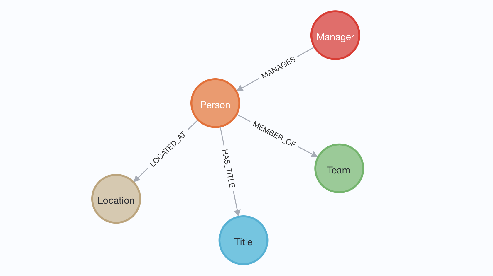
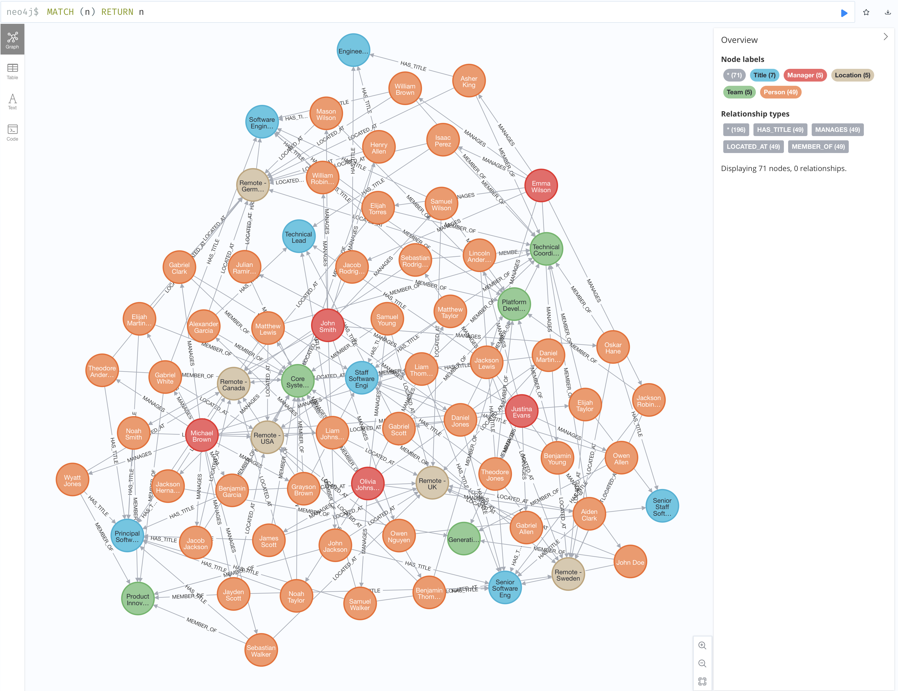

## GraphRAG on Org Chart

Demo on what a GraphRAG setup can look like.

## Data model



## Data visualization



## Setup

### Install deps

```bash
pip install -r requirements.txt
```

### Start Neo4j

```bash
docker run \
    --name testneo4j \
    --rm \
    -p7474:7474 -p7687:7687 \
    --env NEO4J_ACCEPT_LICENSE_AGREEMENT=eval \
    --env NEO4J_AUTH=neo4j/password \
    --env NEO4J_PLUGINS=\[\"apoc\"\] \
    neo4j:enterprise
```

Go to http://localhost:7474 and connect with `neo4j/password`.

### Set environment variables

Copy `.env.example` to a `.env` file and update values of the prefilled keys so they match your setup.

### Write data

In `data/engineering.csv` there are a few example entries (generated by an LLM).

To write the data, run the command:

```bash
python src/write.py
```

Now open the Neo4j Browser on http://localhost:7474 and execute the query `MATCH (n) RETURN n` to see all data. To only see specific teams etc, open the sidebar and click on the labels.

### Question the data

To ask questions using GraphRAG (via a text2cypher approach in this case), run

```bash
python src/main.py
```

and ask questions in the CLI. Exit at any time by pressing `Ctrl+c`.
